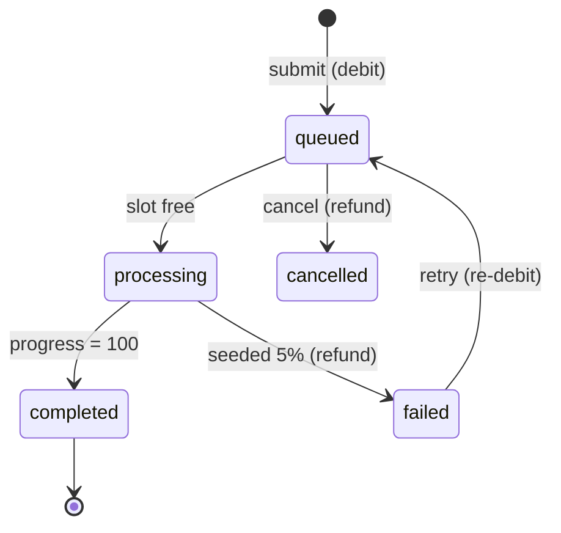
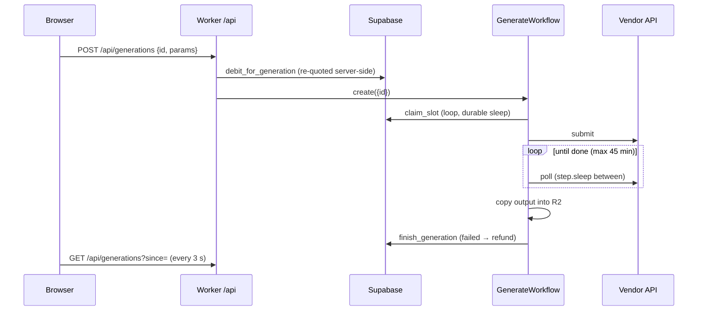
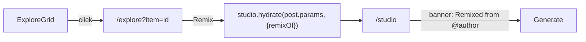

# Product Spec — "Higgsfield Rebuild"

An AI-native cinematic creation suite modelled on Higgsfield Cinema Studio 4.0. By default generation is **simulated client-side**, so the app runs at zero cost on static hosting. With the Worker backend configured, it runs **live**: real vendor models, server-side credits and Stripe payments (section 4b).

Research and sources: [docs/AUDIT.md](docs/AUDIT.md). Wherever this spec departs from Higgsfield, it says so.

---

## 1. Stack

| Layer | Choice | Notes |
| --- | --- | --- |
| Framework | Next.js (App Router) with `output: 'export'` | Pure static HTML/JS in `out/`. No server runtime. |
| Styling | Tailwind CSS v4, shadcn/ui (Radix), Framer Motion | Dark cinematic theme |
| State | Zustand with the `persist` middleware (localStorage) | Stores: `session`, `studio`, `queue`, `library` |
| Auth | `AuthProvider` interface with two implementations: Supabase (`@supabase/supabase-js`, browser client) or a localStorage mock | Supabase is used when `NEXT_PUBLIC_SUPABASE_URL` and `NEXT_PUBLIC_SUPABASE_ANON_KEY` are set at build time |
| Media | Pre-rendered clips and stills in `public/media/`, generated with ffmpeg (no third-party or Higgsfield footage) | Each file is well under Cloudflare's 25 MiB per-asset limit |
| Hosting | Cloudflare Workers static assets (`wrangler.jsonc` → `assets.directory: "./out"`) | `@cloudflare/next-on-pages` is deprecated and not used |
| Backend (live mode) | The same Worker (`worker/index.ts`) handles `/api/*` (`run_worker_first`), with R2 (`MEDIA`), Workflows (`GENERATE`), Supabase Postgres (service role) and Stripe | Off unless `SUPABASE_URL` and `SUPABASE_SERVICE_ROLE_KEY` are set; the client probes `GET /api/config` |

### Static-export constraints and how we handle them

- **No middleware or server redirects.** Route protection happens on the client in `app/(app)/layout.tsx`: without a session it calls `router.replace('/login?next=…')`.
- **No intercepting or parallel routes in export.** Detail views use query params (`/explore?item=<id>`) and render as a modal over the grid.
- **No server actions or route handlers.** In demo mode all mutation happens in client stores. In live mode the API is the Cloudflare Worker, not Next.js, and the stores cache what it returns.
- **`next/image` optimisation is off** (`images.unoptimized: true`).

---

## 2. Data models (`lib/types.ts`)

```ts
type Mode = "video" | "image";
type Resolution = "480p" | "720p" | "1080p" | "4k";
type AspectRatio = "16:9" | "9:16" | "1:1" | "4:5" | "21:9";
type PlanId = "free" | "basic" | "plus" | "ultra";

interface ModelSpec {
  id: string; name: string; vendor: string; mode: Mode; tagline: string;
  pricing: { base: number; resolution: Partial<Record<Resolution, number>> }; // base = credits per 5 s @ 720p (video) or per image
  durations: number[]; resolutions: Resolution[]; aspectRatios: AspectRatio[];
  maxReferences: number;
  supports: { firstLast: boolean; motionRef: boolean; audio: boolean; cinema: boolean };
  minPlan: PlanId; unlimitedOn: PlanId[]; simSeconds: number; badge?: "new" | "top";
}

interface CameraMove { id: string; name: string; group: "static"|"dolly"|"crane"|"pan-tilt"|"orbit"|"zoom"|"drone"|"handheld"|"fx"; }

interface Reference {
  id: string; slot: "first" | "last" | "motion" | "subject";
  kind: "image" | "video"; name: string; url: string; missing?: boolean;
}

interface StudioParams {
  mode: Mode; modelId: string; prompt: string;
  duration: number; resolution: Resolution; aspectRatio: AspectRatio; audio: boolean;
  film:   { genre: string; era: string; tempo: string };
  camera: { body: string; lens: string; aperture: string; moves: string[] /* ≤ 3 */; motionIntensity: number /* 0–100 */ };
  look:   { palette: string; lighting: string };
  characterId: string | null; emotion: string | null;
  references: Reference[]; seed: number;
}

interface Plan {
  id: PlanId; name: string; priceMonthly: number; credits: number;
  concurrency: number; watermark: boolean; allModels: boolean; highlights: string[];
}

interface User {
  id: string; email: string; name: string; avatarUrl?: string;
  provider: "google" | "apple" | "microsoft" | "email" | "mock";
  planId: PlanId; credits: number; freeGenerations: number; createdAt: string;
}

interface CreditLedgerEntry {
  id: string; at: string; delta: number; balanceAfter: number;
  reason: "plan-grant" | "generation" | "refund" | "top-up"; generationId?: string; note: string;
}

type GenerationStatus = "queued" | "processing" | "completed" | "failed" | "cancelled";
type GenerationAction = "generate" | "upscale" | "extend" | "reframe" | "lipsync";

interface Generation {
  id: string; action: GenerationAction; parentId?: string;
  params: StudioParams; status: GenerationStatus; progress: number;
  cost: number; unlimited: boolean; refunded: boolean;
  createdAt: number; startedAt?: number; finishedAt?: number; durationMs: number;
  error?: string; output?: MediaRef; favorite: boolean; remixOf?: string;
}

interface MediaRef { kind: "video" | "image"; src: string; poster: string; width: number; height: number; }

interface Character {
  id: string; name: string; kind: "soul-id" | "soul-cast";
  status: "training" | "ready" | "failed"; progress: number;
  createdAt: number; trainMs: number; thumbnail: string;
  photoCount?: number; cast?: SoulCastParams;
}

interface SoulCastParams { genre; budget; era; archetype; gender; race; age; build; height; eyeColor; hairStyle; hairColor; facialHair; details: string[]; outfit; }

interface CommunityPost {
  id: string; author: string; title: string; media: MediaRef;
  params: StudioParams; likes: number; remixes: number; tags: string[];
}
```

Persistence keys: `hf.session`, `hf.studio`, `hf.queue`, `hf.library`. Each persisted store has a `version` so it can migrate.

---

## 3. Credits & pricing (`lib/pricing.ts`)

```text
cost(params) = ceil( base × (duration / 5) × resolutionFactor[res] × stackFactor + refSurcharge )
  stackFactor  = 1 + 0.1 × max(0, moves − 1)        (each extra stacked move adds +10%)
  refSurcharge = 2 × floor(subjectRefs / 10)        (heavy reference stacks)
  image mode   : base × resolutionFactor × count(1)
```

- The base rates and resolution factors reproduce the S5 table. For example, Kling 3.0 (base 10, ×1.25 at 1080p) costs 25 for 10 s at 1080p, and Cinema Studio (base 25, ×2 at 1080p) costs 100 for 10 s at 1080p.
- The stacking and reference surcharges are **our own** rules. They exist to make the cost of complexity visible. The breakdown popover labels them.
- `quote(params, user)` returns `{ cost, unlimited, lines[], affordable, blockedReason }`. Its output drives both the Generate badge and the paywall.
- **Unlimited:** if `model.unlimitedOn` includes the user's plan, the cost is 0. Those jobs share a single "unlimited lane" per mode, so they run one at a time, as in S5.
- **Debit and refund:** credits are debited at submit (a ledger entry). A `failed` job is refunded in full; this is our policy, since Higgsfield does not refund. A `cancelled` job is refunded only if it was still `queued`.
- **Vendor floor:** a model with a vendor API never costs less than `ceil½(vendorUsd × 1.25 / CREDIT_USD_FLOOR)`. `CREDIT_USD_FLOOR` is the cheapest price at which we sell a credit, across plans and packs ($0.033, Ultra). When the floor applies, the breakdown shows "Raised to cover {vendor}'s cost". `pnpm check:margins` checks every live setting.
- **Vendor limits** are part of validation (`validateForModel`), so the quote blocks settings the vendor would reject:
  - Veo 1080p/4K, and Veo with subject references, need 8 s.
  - Seedance can't combine subject references with 1080p.
  - A last frame needs a first frame.
- **Unlimited on live models** is capped at 30 jobs per user per day (`UNLIMITED_DAILY_CAP`). After that, jobs are charged normally. The server's charge is authoritative.

### Plans (demo values, from S5 and S11)

| Plan | $/mo | Credits | Concurrency | Models | Watermark |
| --- | --- | --- | --- | --- | --- |
| Free | 0 | 0, plus 3 free generations on starter models | 1 | Starter only | Yes |
| Basic | 9 | 120 | 2 | All image models plus starter video models | No |
| Plus | 49 | 1,000 | 4 | All; Unlimited on Kling 3.0 and Soul 2.0 | No |
| Ultra | 99 | 3,000 | 8 | All; Unlimited on Kling 3.0, Seedance 2.0, Soul 2.0 and Nano Banana | No |

In demo mode, choosing a plan on `/pricing` switches to it immediately. This is a **demo checkout**: it grants the plan's credits and writes a ledger entry. In live mode, the same buttons open Stripe Checkout. A subscription grants the plan's credits on every paid invoice. Packs grant credits when checkout completes. Plan changes and cancellations go through the Stripe customer portal.

---

## 4. Generation engine (`lib/engine.ts` and `lib/stores/queue.ts`)



- **Timestamp-driven:** each job's `progress` is derived from `startedAt` and `durationMs`, using an ease curve so it feels like real inference (fast start, slow middle, quick finish). A single 250 ms ticker (`<EngineTicker />`, mounted once in providers) does three things:
  1. recomputes progress for `processing` jobs,
  2. completes or fails jobs whose time is up,
  3. promotes `queued` jobs while there are free slots: `plan.concurrency` for credit jobs, and 1 per mode for unlimited jobs.
- **Resume after reload:** because progress comes from timestamps, a page reload or closed tab picks up where it left off. Any job that should already have finished completes on the first tick.
- `durationMs = model.simSeconds × (duration / 5)^0.5 × res factor`. The total is clamped to 6–40 s so demos stay snappy.
- **Queue position** is the job's index among `queued` jobs, ordered FIFO by `createdAt`.
- **Failure** is a deterministic hash of `id`, with a 5% rate. The error message is chosen from a realistic set: content moderation, capacity, or a timeout.
- **Output** is picked deterministically from `public/media` by `hash(prompt + seed)`, filtered by mode and closest aspect ratio. A free-plan output has a watermark overlay in the UI.
- **Derived actions** (upscale, extend, reframe, lipsync) enqueue a child `Generation` with `parentId`, their own cost and the parent's media:
  - upscale renders at 4k,
  - extend adds 5 s,
  - reframe changes the aspect ratio,
  - lipsync turns on audio.

## 4b. Live backend (`worker/`)

Same state machine, run on the server. Postgres (`generations`) is the source of truth; the browser's queue store is a cache of it.



- **Adapters** (`worker/providers/`): each one implements `submit` and `poll`.
  - Kling 3.0/2.6 use the Kling API directly.
  - Veo 3.1 and Nano Banana 2.1 use the Gemini API. Nano Banana is synchronous, so it stores the image during submit.
  - Seedance 2.0/2.5 use BytePlus ModelArk.
  - Wan 2.7 uses Alibaba DashScope.
  - `mock` reuses `lib/engine.ts`.
- **Which adapter runs:** a model uses its vendor adapter when that vendor's key is set, otherwise `mock`. Derived actions always use `mock`. Kling o1, Cinema Studio and the Soul models have no public API.
- **Errors:** a vendor 4xx (other than 408/429) is a `NonRetryableError`, so the job fails at once. Network errors and 5xx responses retry with backoff.
- **References:** uploads go to R2 under `u/{userId}/refs/`. Adapters send frame and subject references as bytes (base64 or inline data), so vendors never need to reach our URLs. Wan is the exception: it takes a signed public URL.
- **Media:** R2 objects are served at `/api/media/<key>?exp&sig` (HMAC-SHA256 links that expire after 24 h, with Range support for video seeking). Links are re-signed on every list request. Video outputs have no poster; the card shows the first frame.
- **Money:** every balance change happens in one `security definer` SQL function that locks the user's profile row:
  - debit, refund, grant, claim slot, finish and cancel;
  - client-supplied job ids make submit idempotent;
  - Stripe grants are idempotent via `credit_ledger.idempotency_key` and the `stripe_events` table.
- **Progress:** the client animates progress from `startedAt` and the expected duration (the vendor's typical ETA), capped at 95% until the server reports `completed`.

---

## 5. Remix flow



- `hydrate` replaces the whole `StudioParams` (prompt, model, film setup, camera stack, optics, look, references), then validates it against the model catalog. Any reference whose URL is not one of our own is marked `missing: true` and shown as a placeholder slot.
- "Copy parameters" copies the JSON snapshot to the clipboard. "Reuse" in the Library does the same thing as Remix, starting from one of your own generations.

---

## 6. Routes & layout

| Route | Access | Purpose |
| --- | --- | --- |
| `/` | public | Landing: hero reel, model strip, feature sections, CTA |
| `/explore` (`?item=`) | public | Masonry community gallery and detail modal. Remix requires a session. |
| `/pricing` | public | Plans and the demo checkout |
| `/login` (`?next=`) | public | Google / Apple / Microsoft / email + password, with tabs for sign-in and sign-up |
| `/studio` | gated | Creation workbench |
| `/library` | gated | My generations: filters, favourites, quick actions |
| `/characters` | gated | Soul ID training and the Soul Cast builder |

### Component tree (main pieces)

```
app/layout.tsx  → <Providers> (AuthBridge, EngineTicker, Toaster) + <TopNav/>
app/(app)/layout.tsx → <AuthGate> + <QueuePanel/> (right-side, collapsible)
/studio
  <StudioPage>
    <ModeToggle/>                    Photography | Videography
    <PromptBar/>                     prompt, @character, emotion chip
    <ModelPicker/>                   grouped, cost hint per model, lock icon if plan-gated
    <CreationDrawer>
      <Section "Film setup">         Genre · Era · Tempo tiles
      <Section "Camera & motion">    <MoveStack/> (≤3 slots) + <MovePicker/> (65 presets, search, groups) + intensity
      <Section "Optics">             Camera body · Lens · Aperture · Aspect · Duration · Resolution
      <Section "Look">               Palette swatches · Lighting presets
      <Section "Character">          Soul ID / Soul Cast picker · emotion wheel
      <Section "References">         <ReferenceTray/> typed slots with limits
    <GenerateButton/>                live credit badge + <CostBreakdown/> popover
    <RecentStrip/>                   the user's latest outputs
/explore   <MasonryGrid/> → <MediaTile/> (hover play, prefetch on intent) → <PostModal/>
/library   <LibraryFilters/> + <GenerationCard/> (status/progress/actions) + <PaywallDialog/>
/characters <SoulIdTrainer/> + <SoulCastBuilder/> + <CharacterCard/>
```

---

## 7. UX improvements over Higgsfield (from the audit)

1. A **Creation Drawer** with progressive sections. Each section shows summary chips, and every section defaults to "Auto".
2. A **credit badge inside Generate**, with a breakdown popover and the projected balance. The button turns into "Upgrade" or "Top up" *before* you click when the generation is unaffordable.
3. A **Photography / Videography toggle** that keeps the prompt, references and character across both modes.
4. A **Queue panel** showing slots in use, queue positions, progress, cost and refunds.
5. A **typed reference tray**: first, last, motion and subjects (up to 50), each with its limit and hints.
6. A **provenance sidecar**: each download also saves `<name>.json` with the full parameter snapshot.

---

## 8. Mock media

- 10 stylised clips (4–6 s, H.264, no audio), rendered from ffmpeg `lavfi` sources with grade, grain, vignette and slow push-ins. They come in 16:9, 9:16, 1:1, 4:5 and 21:9.
- Every clip has a JPEG poster, which doubles as the still for image mode.
- Total size is about 3.4 MiB, and every file is far under 25 MiB.
- There are no third-party licensing issues: all the footage is synthetic and generated in-repo by `scripts/gen-media.sh`.

---

## 9. Roadmap

| Phase | Scope |
| --- | --- |
| P0 | Scaffold, static export, wrangler config, app shell, mock media |
| P1 | Catalog, types and pricing; auth and credits; Studio with the Creation Drawer; generation engine and queue panel |
| P2 | Explore masonry, detail modal, Remix |
| P3 | Library and quick actions with provenance download; Characters (Soul ID and Soul Cast) |
| P4 | Landing, pricing and paywall; empty and error states; responsive pass; README and deploy |
| P5 | Live mode: Worker API, vendor adapters (Kling, Veo, Nano Banana, Seedance, Wan), Workflows, R2 media, Supabase credits and generations, Stripe checkout, portal and webhook |
| Later | Vendor posters/thumbnails; real upscale, extend and lip sync; server-side Characters; Explore publishing; projects |
